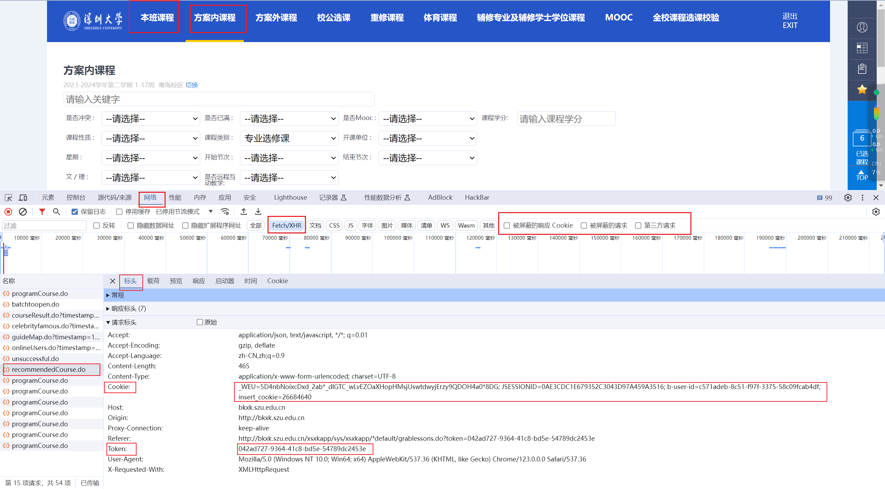
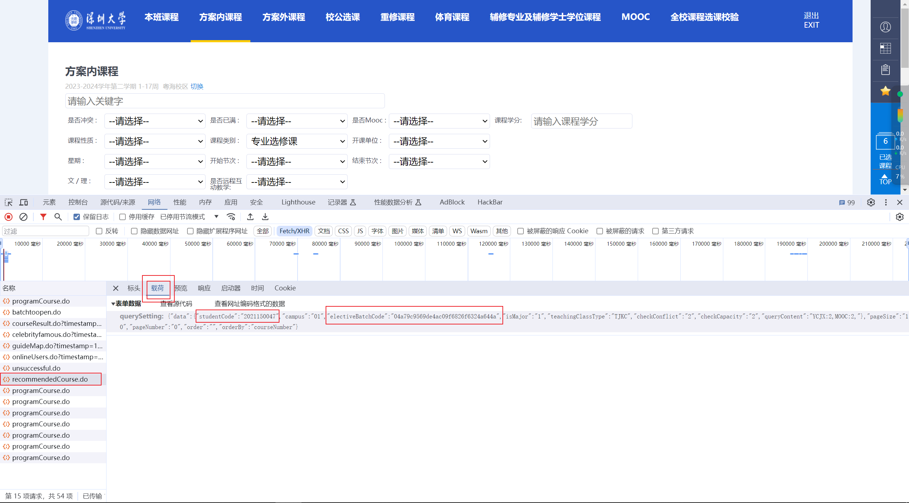
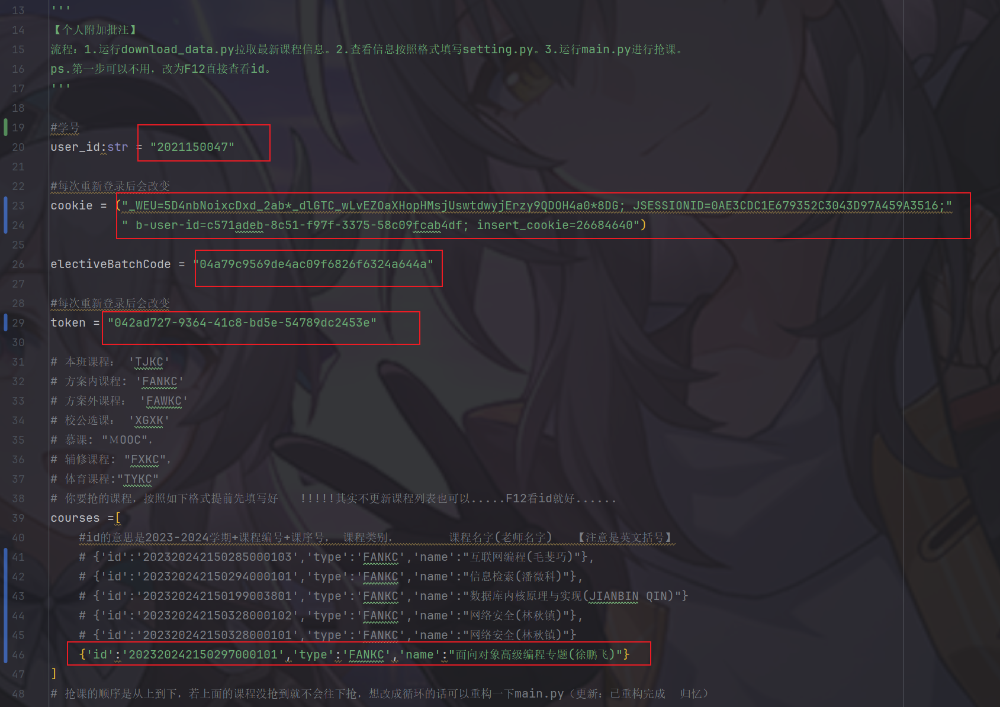
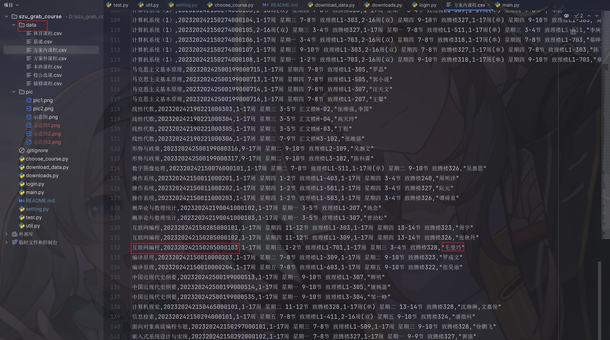
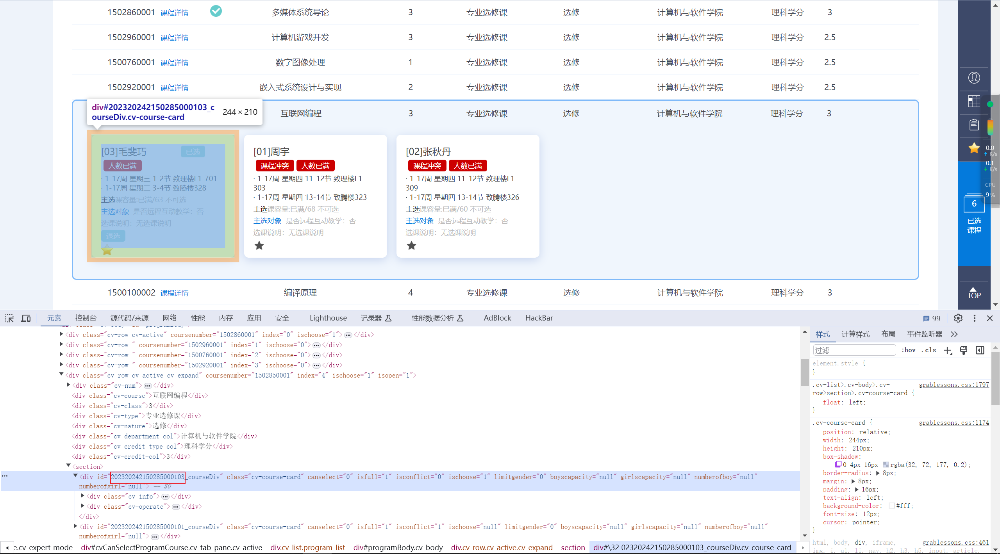
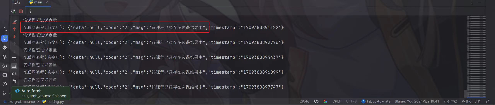

# szu_grab_course

szu_grab_course是基于python的深圳大学抢课脚本，下载后简单配置即可使用。

复刻于https://github.com/Lewin671/YourLesson 后进行维护和更新。


## 联系方式

微信号：guiyiac

邮箱：1677852098@qq.com

个人博客：https://blog.csdn.net/qq1677852098


## 下载

`git clone https://github.com/guiyi886/szu_grab_course`


## Python环境
相关pthon库如下
```
Package    Version   
---------- ----------
certifi    2018.11.29
chardet    3.0.4     
idna       2.8       
pip        19.0.3    
requests   2.21.0    
setuptools 40.8.0    
urllib3    1.24.1    
wheel      0.33.1  
```
注意是`python3`，有些电脑在终端中输入`python`默认使用`python2`，那么这时可以输入`python3`而不只是`python`。


## 配置并运行抢课程序

1. 先在网页上登录，然后F12打开控制台，点击网络（network）。点击一下方案内课程，再点击本班课程，会看到出现一个recommendedCourse.do，点击后在标头的请求标头中可以看到Cookie和Token。（每次重新登录后会变）

   


2. 点击载荷可以看到studentCode和electiveBatchCode。

   


3. 复制到setting.py文件的配置部分。

   


4. courses部分的信息获取有两种方法：
	（1）运行download_data.py下载课程信息到data文件夹，下载完课程相关数据后，就可以在`data`文件夹下查看相关课程信息，根据这些信息来配置`setting.py`文件中的course部分。
	

   

	（2）直接F12，ctrl+shirt+c后点击要选的课，在源代码中查看课程id。
	


5. 配置完`setting.py`后，运行main.py即可开始抢课。出现如下提示说明已抢到课程。
   

